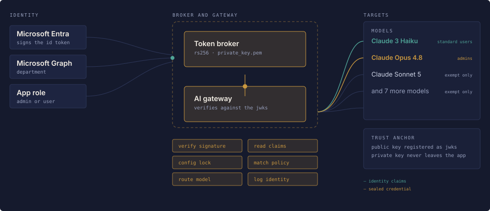
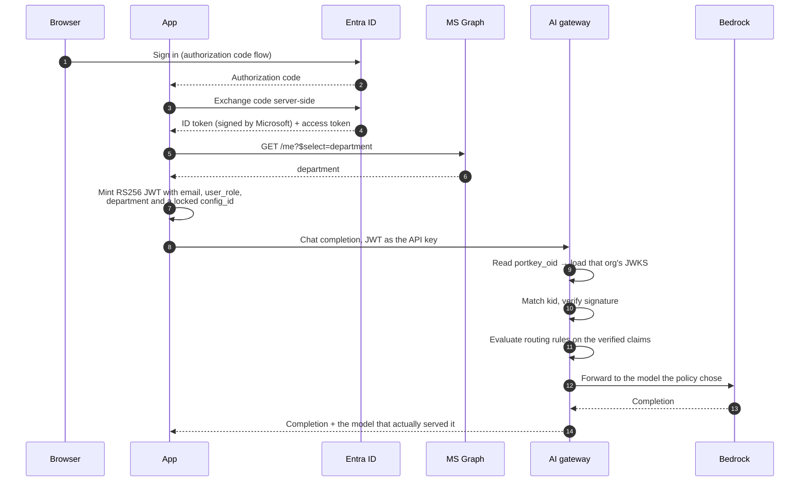
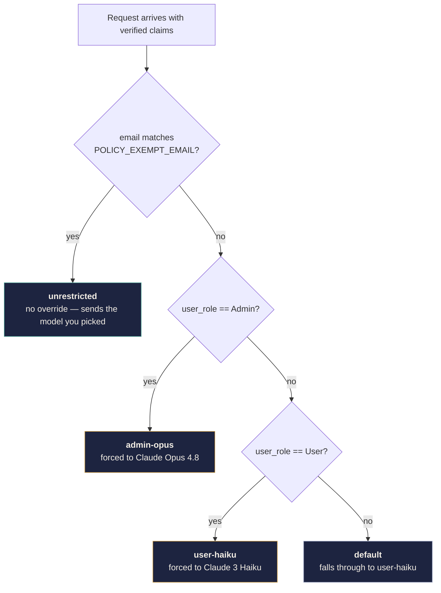

# Enterprise AI Access

A Streamlit chat app that lets employees use LLMs **without ever holding an API key**, and lets the organization decide which model each person is allowed to reach — enforced cryptographically, not in the browser.

Users sign in with Microsoft Entra ID. The backend reads their app role and department, seals those facts into a short-lived RS256 JWT, and sends that token to an AI gateway as the API key. The gateway verifies the signature against a registered public key, reads the claims it now trusts, and routes the request accordingly.

Pick a model your role isn't allowed to use, and a different one answers. That's the demo.

---

## How it works

Two JWTs are involved, and telling them apart is the key to understanding the design.

The **first** is issued by Microsoft and proves who you are. The **second** is issued by this app and tells the gateway what you're allowed to do. The backend is a *token broker*: it consumes a token it trusts and mints a different one the gateway trusts.



*The sign-in page renders this live, animating a request end to end for a standard user, an administrator and an exempt account.*

In detail:



Steps 10 and 11 are why this is secure. The claims are readable by anyone — a JWT payload is just base64 — but they are **sealed**. Change one byte of `user_role` and the signature no longer verifies.

---

## What you need

| | |
|---|---|
| **Microsoft Entra ID tenant** | With rights to register an app, create App Roles, and assign users. Needs Application Administrator or higher. |
| **An AI gateway with JWKS auth** | Portkey or Prisma AIRS. You must be able to register a JWKS at the organization level. |
| **A model provider integration** | This demo uses Amazon Bedrock, configured in the gateway as a provider slug. |
| **Python 3.11+** | 3.12 recommended. |

---

## Install

```bash
git clone https://github.com/sergeiudo/AI-Gateway-JWT-Demo
cd AI-Gateway-JWT-Demo

python3 -m venv .venv
source .venv/bin/activate
pip install -r requirements.txt
```

Then generate the signing keypair. Do this **before** the first `streamlit run` — the app opens both key files at import time with no error handling, so a missing key surfaces as a raw traceback in the browser.

```bash
python3 generate_keys.py
```

This writes two halves of one RSA-2048 keypair:

- `private_key.pem` — stays on the backend, **signs** tokens
- `jwks.json` — the public half, handed to the gateway, **verifies** tokens

Re-running the script overwrites both and generates a new `kid`. If you do, you must re-register the new `jwks.json` or every token will fail.

The remaining setup is configuration in three places — Entra, the gateway, and `.env` — then you can run it.

---

## Microsoft Entra ID setup

### 1. Register the application

**Microsoft Entra ID → App registrations → New registration**

- **Supported account types:** Accounts in this organizational directory only (single tenant)
- **Redirect URI:** platform **Web**, value `http://localhost:8501/`

> The trailing slash matters — Entra compares the redirect URI as an exact string, and it must match `REDIRECT_URI` in your `.env` character for character.

> Do **not** choose the *Single-page application* platform. This is a confidential client: it exchanges the authorization code server-side using a client secret, which the SPA platform type forbids.

### 2. Collect credentials

From **Overview**: **Application (client) ID** and **Directory (tenant) ID**.

From **Certificates & secrets → New client secret**: copy the **Value** column, not **Secret ID**. The Value is masked permanently once you leave the page.

### 3. API permissions

**API permissions** should already list **Microsoft Graph → User.Read (Delegated)**. Add it if missing, then click **Grant admin consent**.

Admin consent isn't strictly required — `User.Read` is user-consentable — but many tenants disable user consent by policy, and when they do, sign-in fails with `AADSTS65001` and no useful message in the UI. Granting it up front removes that failure mode.

`User.Read` is what allows the `/me?$select=department` call. Without it, every user silently falls back to department `General`.

### 4. Create the App Roles

**App registrations → your app → App roles → Create app role**, twice:

| Display name | Allowed member types | Value | Enabled |
|---|---|---|---|
| App Admin | Users/Groups | `Admin` | yes |
| App User | Users/Groups | `User` | yes |

**Value** is the only field the code reads, and the comparison is case-sensitive. `admin` or `Administrator` will not match.

> These are **App Roles**, not **Directory roles**. The "Directory roles" list you see while creating a user contains tenant-wide administrator privileges like Global Administrator — a fixed Microsoft catalog that you cannot add to. Your `Admin` and `User` roles will never appear there. Users of this app need no directory role at all.

### 5. Assign users

**Microsoft Entra ID → Enterprise applications → your app.** This is a different blade from App registrations — same app, two views. App registrations is where you *define* roles; Enterprise applications is where you *assign* them.

1. **Properties → Assignment required? → Yes.** Without this, an unassigned user isn't rejected; they arrive with no `roles` claim and are silently treated as a Standard User. Requiring assignment makes misconfiguration loud instead of silent.
2. **Users and groups → Add user/group** → pick the user, pick the role, **Assign**.

> Assigning an App Role to a **group** requires Entra ID P1 or P2. On the free tier you can only assign to individual users. Create two test users — one of each role — so you can demo both routing paths without reassigning.

### 6. Set Department

**Microsoft Entra ID → Users → select user → Properties → Edit → Job information → Department.**

Department is not a default token claim, which is why the app fetches it from Graph. Guest (B2B) accounts and personal Microsoft accounts usually have it blank and will fall back to `General`.

---

## Gateway configuration

### 1. Register the public key

Paste the contents of `jwks.json` into your gateway under organization-level JWT/JWKS authentication, and note your **organisation ID** while you're on that page — you'll need it for `PORTKEY_ORG_ID`, and it's usually shown alongside.

```bash
pbcopy < jwks.json
```

> **Use that command rather than selecting text in a terminal.** The `n` value is a single 342-character line and terminal pagers clip it. A truncated modulus is a *different key*, and every request then fails with an opaque 401. If what you pasted ends in `$`, it was clipped.

### 2. Add a provider integration

Set up your model provider — this demo uses Amazon Bedrock — and note its slug, e.g. `@your-bedrock`.

### 3. Create the routing config

Create a conditional config and note its `pc-...` id.

```json
{
  "strategy": {
    "mode": "conditional",
    "conditions": [
      {
        "query": { "metadata.email": { "$eq": "exempt.user@example.com" } },
        "then": "unrestricted"
      },
      {
        "query": { "metadata.user_role": { "$eq": "Admin" } },
        "then": "admin-opus"
      },
      {
        "query": { "metadata.user_role": { "$eq": "User" } },
        "then": "user-haiku"
      }
    ],
    "default": "user-haiku"
  },
  "targets": [
    {
      "name": "unrestricted",
      "provider": "@your-bedrock"
    },
    {
      "name": "admin-opus",
      "provider": "@your-bedrock",
      "override_params": { "model": "us.anthropic.claude-opus-4-8" }
    },
    {
      "name": "user-haiku",
      "provider": "@your-bedrock",
      "override_params": { "model": "anthropic.claude-3-haiku-20240307-v1:0" }
    }
  ]
}
```

### How routing resolves



Three things worth noting:

- **Order matters.** Conditions are evaluated top to bottom and the first match wins, which is why the address exemption sits above the role rules. Move it below and the exempt account would match `user_role: User` first and get pinned.
- **A target without `override_params` is pass-through.** That's what makes the exemption work — it forwards whatever model the app asked for.
- **`default` is a security decision.** It points at the most restricted route, so an unrecognised caller is constrained rather than privileged.

The app keeps a copy of this JSON in `GATEWAY_CONFIG` and derives its own UI from it — the sidebar ledger, the explanation panel, and the routing simulation all read from that one structure. Keep it in step with what's actually in the gateway; the gateway is what enforces, the app only explains.

---

## Environment

```bash
cp .env.example .env
```

Then fill it in:

| Variable | Notes |
|---|---|
| `AZURE_CLIENT_ID` | Application (client) ID |
| `AZURE_CLIENT_SECRET` | The secret **Value** |
| `AZURE_TENANT_ID` | Directory (tenant) ID |
| `REDIRECT_URI` | Must match the app registration exactly |
| `PORTKEY_ORG_ID` | Tells the gateway whose JWKS to verify against |
| `PORTKEY_WORKSPACE_SLUG` | Workspace the token is scoped to |
| `PORTKEY_PROVIDER` | Provider integration slug, e.g. `@your-bedrock` |
| `PORTKEY_BASE_URL` | Gateway endpoint — confirm this for your tenant |
| `PORTKEY_DEFAULT_CONFIG_ID` | The `pc-...` config, locked inside every token |
| `POLICY_EXEMPT_EMAIL` | Optional. One address exempt from routing. Leave blank and everyone is routed by role. |
| `PRIVATE_KEY_PATH` / `JWKS_PATH` | Defaults are fine |

---

## Run it

```bash
streamlit run app.py
```

Open `http://localhost:8501`.

> Editing `.env` while the app runs has no effect. Streamlit only watches `.py` files, and `load_dotenv()` won't override values already in the environment. Restart the process, and sign in again — the token is minted once at login.

### What you'll see

- **Sign-in page** — a live diagram animating three routing scenarios end to end, plus the gateway policy in full
- **Credential strip** — your actual JWT split into header, payload and signature, with the claims that drive routing and the time left on the token
- **Policy ledger** — your requested model struck through above the one the gateway will enforce, or a calm confirmation when they agree
- **Served-by stamp** — under each reply, the model that actually answered, read from the gateway's response

The sharpest test: as a Standard User, pick a model your role isn't allowed, send a message, and watch a different one answer.

---

## Troubleshooting

**`401 Invalid API Key. Error Code: 03`**
The gateway couldn't verify your token. Note that sending *no* credential at all produces this identical message, so it isn't specific. In order of likelihood: the JWKS you registered doesn't match your current `private_key.pem` (most often a truncated `n` — it must be 342 characters for RSA-2048); `PORTKEY_ORG_ID` is wrong; or `PORTKEY_BASE_URL` points at a different gateway than the one holding your JWKS.

**Role shows Standard User when you assigned Admin**
The `roles` claim didn't arrive. Check the assignment under Enterprise applications, that the role's **Value** is exactly `Admin`, and that it wasn't assigned via a group without P1/P2. Sign out fully and back in — Entra caches tokens briefly.

**Department shows `General`**
Either Job information isn't set on the user, or the Graph call failed. A non-200 from Graph falls through to the fallback without surfacing an error.

**`412 model_not_allowed_error`**
The model isn't in that integration's allowlist, or belongs to a different provider integration entirely. Check that the model ID is one your integration actually exposes.

**Bedrock invocation error mentioning throughput or inference profiles**
Newer Anthropic models on Bedrock can only be invoked through a cross-region inference profile, meaning a region-prefixed ID like `us.anthropic.claude-opus-4-8` rather than the bare name.

**Sign-in skips the account picker**
Already handled — the app passes `prompt=select_account`. Note that the app's Sign out only clears its own session, not your Microsoft session.

**Everything worked, then stopped after an hour**
Tokens carry `exp: now + 3600` and there's no refresh. Sign out and back in.

---

## Security notes

`private_key.pem` is the most sensitive file here. Anyone holding it can mint a token asserting any role for any address, and the gateway will believe it, because that signature is the only thing it trusts. It is gitignored alongside `.env` and `jwks.json`, and should never be committed or served to a browser.

The **public** half is not secret. Publishing `jwks.json` is exactly what it's for — a verifier can check signatures with it but cannot produce them. That asymmetry is the whole point of using RS256 rather than a shared HMAC secret: a compromised gateway can't impersonate your users.

Tokens expire after one hour. Claims are embedded before signing, so headers cannot be tampered with client-side. The routing config id is injected by the backend, not chosen by the caller.

For production, keep the signing key in a KMS or HSM — Azure Key Vault can hold the key and perform the signing so the private material never reaches the application — and publish the JWKS at a URL so rotation doesn't mean re-pasting JSON.

---

## Repository layout

```text
├── app.py                  # Streamlit UI, MSAL auth, JWT minting, gateway client
├── generate_keys.py        # RSA-2048 keypair + JWKS generator
├── .env.example            # Environment template
├── .streamlit/config.toml  # Base theme
├── assets/                 # Static image assets
└── requirements.txt
```
